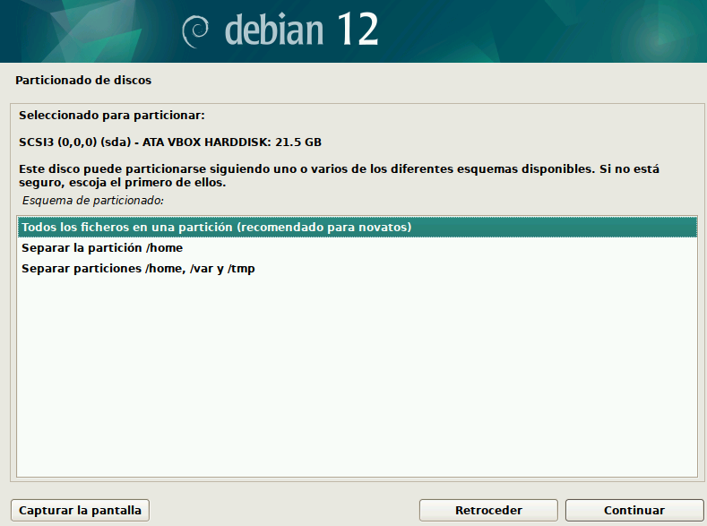
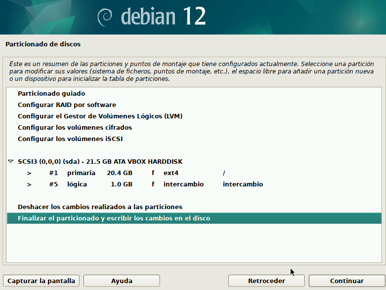
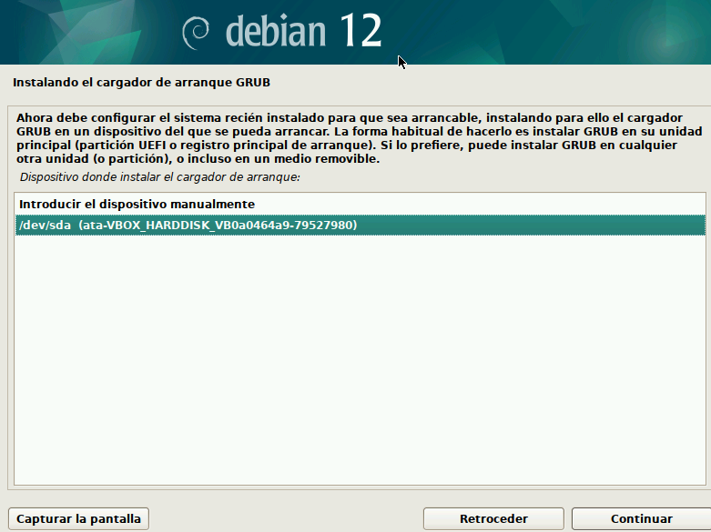

# 🖥️ HARDWARE – PRÁCTICA CHROOT

## 🔧 Instalamos la máquina Debian
   
---

## 🍥 Instalación de Debian
   
---

---

## 🛠️ Instalamos el disco Kali en la máquina Debian

---

## 😼​ Kali

Desde kali cambiaremos el idioma al español con "setxbkmap es" y con sudo su comprobamos con /dev

Creamos el directorio /mnt/recuperar y montamos la particion del disco en el

Montamos la particion 1 del disco en el directorio que acabamos de crear

🟥 **Dev:** _Montamos el directorio /dev dentro de la ruta /dev/recuperar/dev._

🟦 **Proc:** _Montamos el directorio /proc dentro de /mnt/recuperar/proc._

🟧 **Sys:** _Montamos el directorio /sys dentro de /mnt/recuperar/sys._

Creamos una jaula con el comando chroot /mnt/recuperar, lo que nos permite trabajar dentro del sistema instalado en el disco (/dev/sda) como si fuera el único entorno, aislándonos de la Live.

Creamos una archivo para ver si cuando volvemos a Debian los cambios se han guardado 

---

## 💽 Quitamos el disco de Kali
  

---

## ✅ Verificación final

Y comprobamos que lo que hicimos desde Kali se ha guardado correctamente y es accesible desde Debian.

