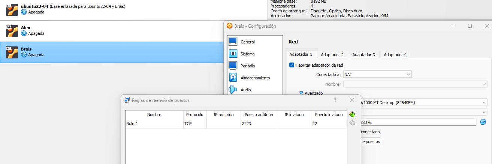
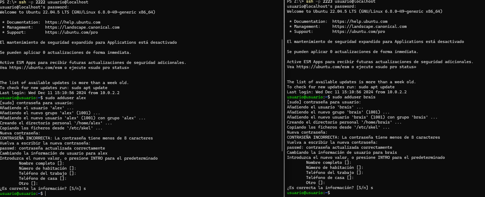
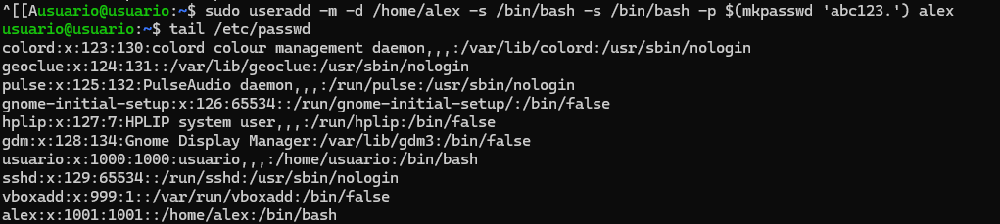
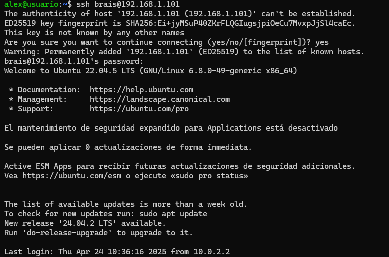
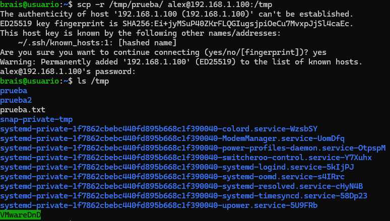
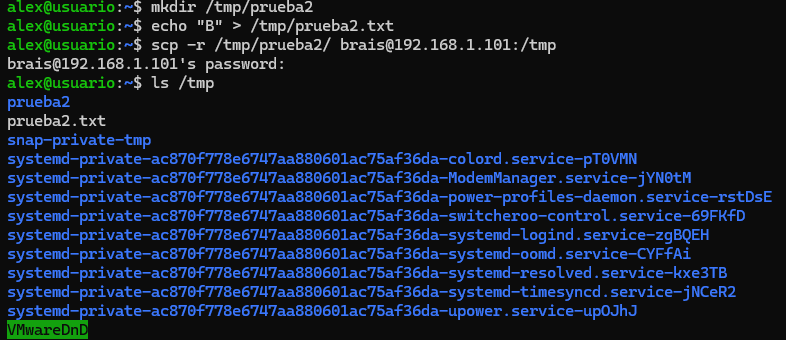
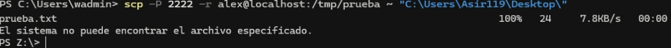
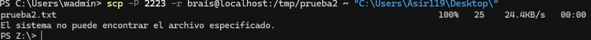
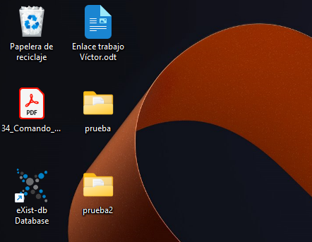
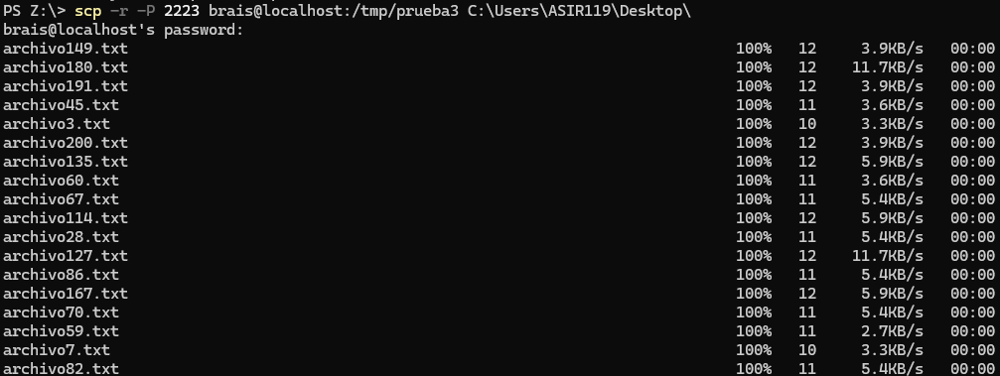

# 🖥️ Trabajo con SSH y SCP

Este documento describe paso a paso la configuración y uso de SSH y SCP entre dos máquinas virtuales.

---

## 🔧 **Hardware y configuración de red**

**Configuramos las dos clonaciones enlazadas**, asignándoles los puertos correspondientes y colocándolas en el adaptador 2 como **red interna**:

---

## 👤 **Creación de usuarios**

Creamos ambos usuarios en cada máquina:

---

## 🛠️ **Corrección de la configuración**

Accedemos a la máquina A y la configuramos

---

## 🔐 **Conexión SSH desde máquina A a máquina B**

Desde la máquina A, accedemos a la máquina B utilizando SSH:

---

## 📁 **Creación y transferencia de archivos**

### 📄 **1. Crear `prueba` en máquina B**
Creamos el archivo `prueba` en la máquina B:

### 🔁 **2. Transferir `prueba` de B a A**
Usamos `scp` para transferir el archivo a la máquina A:

### 📄 **3. Crear `prueba2` en máquina A**
Desde la máquina A, creamos el archivo `prueba2` para transferirlo a la máquina B:

### 📄 ** Pasar `prueba` y  `prueba2` al escritorio**

Ahora pasaremos ambos archivos directamente al escritorio

### 📂 **4. Crear y transferir carpeta `prueba3`**
Creamos una carpeta llamada `prueba3` con 200 archivos dentro:

Transferimos la carpeta `prueba3` al escritorio:

---

## ✅ **Verificación final**

Comprobamos que la carpeta `prueba3` se haya copiado correctamente al escritorio:

---

## 📝 **Notas finales**

> ⚠️ **Nota:** Me he confundido creando `prueba1` en la máquina 2 y `prueba2` en la máquina 1, pero **el funcionamiento fue el mismo**.

---

